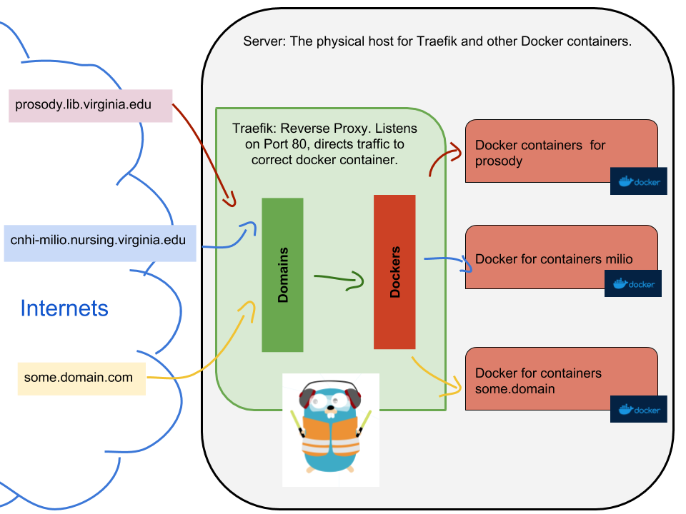

# Traefik as Reverse Proxy for Docker

This details the setup for using Traefik https://traefik.io/ as a reverse proxy
for Docker containers hosting various web apps.



Traefik acts as a reverse proxy, listening on port 80 and redirects traffic to
the correct Docker container. Traefik itself is running in a Docker container.
Traefik listens on the Docker daemon, and detects when new containers are spun
up, and automatically provisions itself to serve traffic to that container.
When using Docker in swarm mode, muliple containers of the same image are
automatically provisioned for load balancing.

# Production and Development Setup

On your laptop or the production server, clone or pull the latest from the repo
to get the most recent version of the 'docker-compose.yml' and 'traefik.toml'
files.

- `git clone https://github.com/scholarslab/traefik.git traefik`

  or

- `git pull`

- Create a Docker network
  - `docker network create --subnet=172.42.0.0/24 --gateway=172.42.0.1 thenetwork`
    - This is already created on the production server.

- Edit the docker-compose.yml to use the correct traefik.toml file
  - `local.traefik.toml` for local development on your laptop
  - `traefik.toml` for production
  The file looks like this:
  ```
  version: '2'

  services:
    traefik:
      image: traefik:1.6
      restart: always
      command: --api --docker --logLevel=DEBUG
      ports:
        - "80:80"
        - "8080:8080"
        - "443:443"
      volumes:
        - /var/run/docker.sock:/var/run/docker.sock
        # Use the correct file for development or production
        - ./local.traefik.toml:/traefik.toml
        - ./acme.json:/acme.json
      container_name: traefik

  networks:
    default:
      external:
        name: thenetwork

  ```
  Line by line explanation
  - `version: '2'`: use version 2, because the production server can only use
    version 2 (need to upgrade docker version on production server).
  - `services:` Docker services section (the group of containers)
  - `traefik:` The name of the docker service
  - `image: traefik` The name of the image (if no URL given, looks in default
    locations on Docker Hub). This is the default Traefik image, the latest
    version. Use a set version so that if the server or the Traefik container
    restart, it doesn't pull in the newest version (if different) and break
    things.
  - `restart: always` If the service dies, restart. Helpful when the server is
    restarted, then this will automatically restart once Docker is up
  - `command: --api --docker` these are flags that are added to Traefik when it is run inside the container.
    - `--api` allows for the Web UI and the API to be active
    - `--docker` starts the Docker specific functionality
    - `--logLevel=DEBUG` change to ERROR for production
  - `ports:` Start the ports section, which ports to bind to on the host and which ports to open on the container "HOST:CONTAINER"
    - `- "80:80"` Bind to port 80 on the host, and open port 80 on the
      container, for HTTP traffic. Binds to the server's port 80, so this takes
      in all HTTP traffic to the server.
    - `- "8080:8080"` Bind to port 8080 on the host, and open port 8080 on the container. Used when the Web UI and API are needed.
    - `- "443:443"` Bind to port 443 on the host, and open port 443 on the container, for SSL
  - `volumes:` Begins the volume section. This is basically a symbolic link
    that maps a folder or file on the host to a folder or file in the
    container. "/path/on/host:/path/in/container"
    - `- /var/run/docker.sock:/var/run/docker.sock` map the docker.sock file on the host to the path in the container. Lets Traefik listen to Docker events
    - `- ./traefik.toml:/traefik.toml` Passes the Traefik config file into the container. This file must be in the same folder (same level) as this docker-compose.yml file.
    - `- ./acme.json:/acme.json` folder containig the SSL certs for the domains. Only used on production.
  - `container_name: traefik` Sets the name of the container.
  - `networks:` The networks available to all of the services referenced in this docker-compose.yml file. 
    - `default:` The default network, a Docker network named 'default'. Used here, it means we are overriding the default Docker created network and associating it with the network named below.
      - `external:` This network is not created when this docker-compose.yml file is run. It references an existing Docker network, created by running `docker network create network_name`
        - `name:` the name of the externally created network. in this case 'thenetwork'. This must already be created before this docker-compose.yml file can be run.

- local.traefik.toml
  ```
  debug = true

  logLevel = "ERROR"

  defaultEntryPoints = ["http"]

  [entryPoints]
    [entryPoints.http]
    address = ":80"

  [retry]

  [web]
  address = ":8080"
  ```
  Line by line explanation
  - `debug = true` allow Traefik to show debug errors
  - `logLevel = "ERROR"` Show log at level ERROR (of "DEBUG", "INFO", "WARN", "ERROR", "FATAL", "PANIC")
  - `defaultEntryPoints = ["http"]` The default entry points to list to (http only for local development)
  - `[entryPoints]` begins the entryPoints section.
  - `[entryPoints.http]` begins the entryPoints section for the http entryPoint
  - `address = ":80"` http should listen to port 80
  - `[retry]` restart Traefik if the server is restarted or it shuts down for some reason
  - `[web]` begin the web section
  - `address = ":8080"` The address that the web UI will listen on. 

- traefik.toml
  - This will have lines that take care of https, SSL, through Let's Encrypt.
    - still under development

## Start the Traefik container
With these two files, simply start up a Docker container. Traefik will bind to
port 80 on the host and manage all incoming traffic on that port, re-routing
domains to appropriate containers.

- `docker-compose up -d` the -d flag runs the service in the background. Leave off -d if you want to see output for development.

## Start other domain containers
Also, now start up some Docker containers that serve web applications. Traefik
will automatically detect them and route traffic to them as appropriate. See how below.


# Set up a Web App to use traefik

Web Apps in Docker containers must have the following configuration added to
their docker-compose.yml files in order for Traefik to manage them.

If a service should NOT be available to Traefik (the backend database
container, for example), then add a label to the service.

- db section
  ```
  labels:
    - "traefik.enable=false"
  ```

To add a service to Traefik, add the following labels:

- web app section
  ```
    expose:
      - "80"
    labels:
      - "traefik.docker.network=thenetwork"
      - "traefik.enable=true"
      - "traefik.port=80"
      - "traefik.backend=container_name"
      - "traefik.frontend.rule=Host:domain.name.org"

  ```

And add the following networks section to the docker-compose file (same level as the services line):

-  networks section
  ```
  networks:
    default:
      external:
        name: thenetwork
  ```

So the whole file would look something like this:

- docker-compose.yml (for web app)
  ```
  version: '2'

  services:
    milio_db:
      image: mysql:5.7
      container_name: milio_db
      volumes:
        - ./db_data:/var/lib/mysql

        # This line is only used for the initial start up (the very first time
        # docker-compose is run or if there is no data in the 'db_data' folder
        - ./initial_sql/neatline_milio.sql:/docker-entrypoint-initdb.d/milio_initial.sql
      restart: always
      environment:
        MYSQL_ROOT_PASSWORD: ${MYSQL_ROOT_PASSWORD}
        MYSQL_DATABASE: ${MYSQL_DATABASE}
        MYSQL_USER: ${MYSQL_USER}
        MYSQL_PASSWORD: ${MYSQL_PASSWORD}
      labels:
        - "traefik.enable=false"

    milio_omeka:
      build:
        context: .
      depends_on:
        - milio_db
      image: milio:0.4
      container_name: milio_omeka
      volumes:
        - ./omeka:/var/www/html/
      restart: always
      environment:
        OMEKA_DB_HOST: ${OMEKA_DB_HOST}
        OMEKA_DB_USER: ${MYSQL_USER}
        OMEKA_DB_PASSWORD: ${MYSQL_PASSWORD}
        OMEKA_TABLE_PREFIX: ${OMEKA_TABLE_PREFIX}
      expose:
        - "80"
      labels:
        - "traefik.docker.network=thenetwork"
        - "traefik.enable=true"
        - "traefik.port=80"
        - "traefik.backend=milio_omeka"
        - "traefik.frontend.rule=Host:cnhi-milio.nursing.virginia.edu"

  networks:
    default:
      external:
        name: thenetwork
  ```

Now just start the container and Traefik handles the domain routing (and for production, also SSL).
- `docker-compose up -d`

## Local Development

The final thing to do for development is to change your /etc/hosts file to redirect the domain name to your local machine.
- edit the `/etc/hosts` file with Vim or your favorite editor (requires root priviliges), and add a line like so to the bottom of the file:
  - `127.0.0.1 cnhi-milio.nursing.virginia.edu`

This will make your computer think that the domain name points to your local machine, and then your local machine will use Traefik to route traffic to the Docker container you just set up.
